<p align="center">
  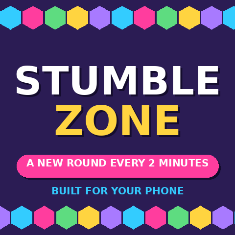
</p>

<h1 align="center">Stumblezone</h1>

<p align="center">
  <strong>The game show that runs itself — and the crowd plays too.</strong><br>
  A party gauntlet for Decentraland Mobile. A new round every two minutes, on the clock,<br>
  with no host, no lobby and no server. Fall, and you're not out: you're the crowd.
</p>

<p align="center">
  <a href="https://decentraland.org/jump/?realm=justchatting.dcl.eth"></a>
  <a href="#getting-started"></a>
  <a href="#testing"></a>
  <a href="LICENSE"></a>
</p>

<p align="center">
  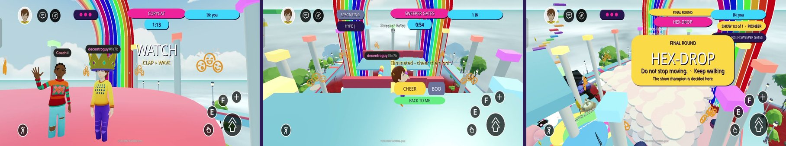
</p>

<p align="center">
  <a href="https://decentraland.org/jump/?realm=justchatting.dcl.eth"><b>▶ Play now</b></a> ·
  <a href="docs/SUBMISSION.md"><b>Submission notes</b></a> ·
  <a href="docs/ARCHITECTURE.md"><b>Architecture</b></a> ·
  <a href="docs/TESTING.md"><b>Phone checklist</b></a> ·
  <a href="CREDITS.md"><b>Credits</b></a>
</p>

---

## Contents

- [Play it](#play-it)
- [What it is](#what-it-is)
- [The rounds](#the-rounds)
- [The show](#the-show)
- [The crowd](#the-crowd)
- [Stumble Village](#stumble-village)
- [Moments](#moments)
- [Built for a phone](#built-for-a-phone)
- [How it works](#how-it-works)
- [Getting started](#getting-started)
- [Project layout](#project-layout)
- [Testing](#testing)
- [Judging criteria](#judging-criteria)
- [Roadmap](#roadmap)
- [Credits and licence](#credits-and-licence)

---

## Play it

Open the **Decentraland mobile app** and go to **`justchatting.dcl.eth`**, or tap
<https://decentraland.org/jump/?realm=justchatting.dcl.eth> on any device.

You will arrive at a random second of a random round. If it is a clock-driven round you are dropped
straight in (*JOINED LATE — GO!*); if not, the banner counts down to the next one while you bounce on
the pads. **Walk and jump is the entire control scheme.** Four rounds make a show; the show ends on a
podium. The whole loop is eight minutes, and it never stops.

<p align="center">
  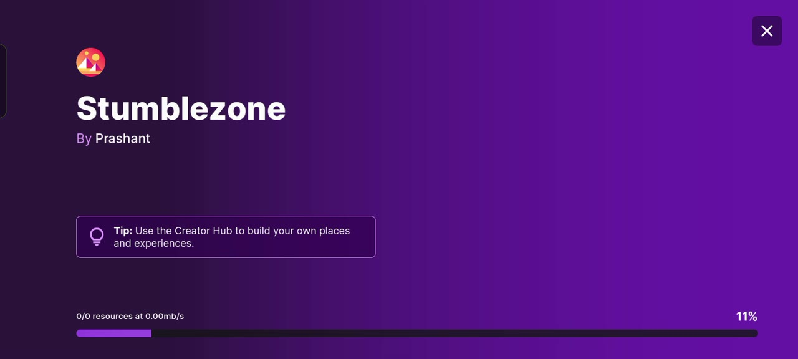
  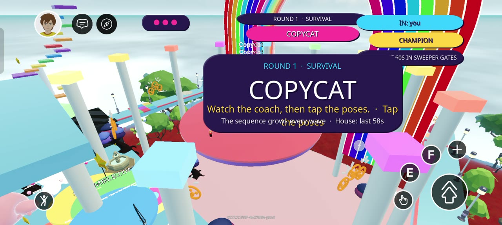
</p>

---

## What it is

One arena, eight rounds, a village around it. A new round starts **every two minutes** whether anyone
is watching or not, because the schedule is a pure function of the clock: there is nothing to host
and nothing to go down. Every phone computes the same round, the same layout and the same seed from
the time of day, so everyone in the World sees the same thing at the same instant with no server
deciding it.

Every round is a survival challenge **against the arena**, never directly against another player.
That is what lets the same code be an eight-player elimination show, a two-player grudge match, or
a solo score attack at 3 am — without a lobby, a queue, or a minimum player count.

The genre debt is to the party-show format; the research behind every colour, sound and camera
choice is in [docs/FALLGUYS-PRESENTATION.md](docs/FALLGUYS-PRESENTATION.md).

---

## The rounds

<p align="center">
  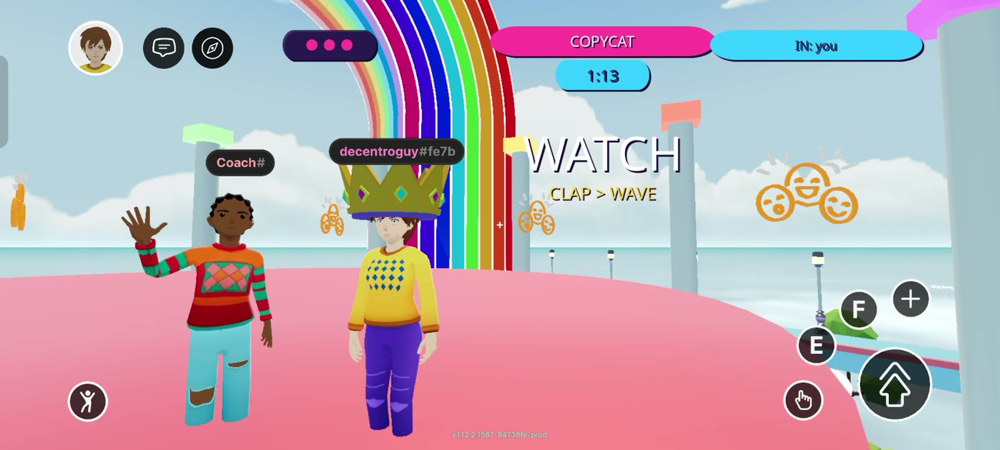
  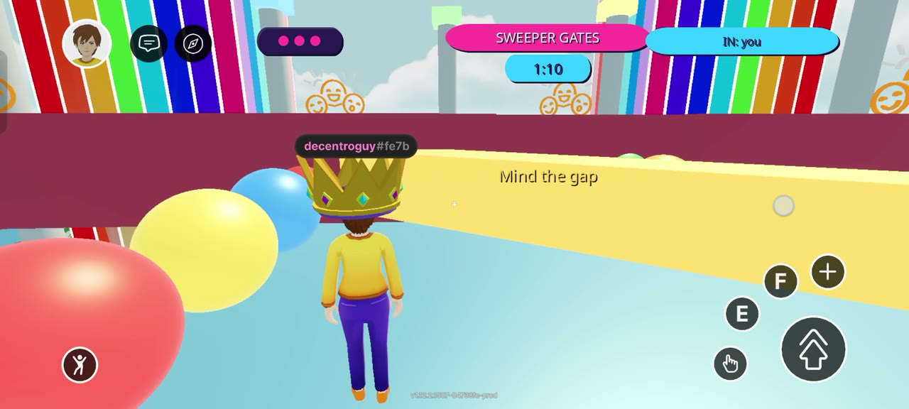
</p>
<p align="center">
  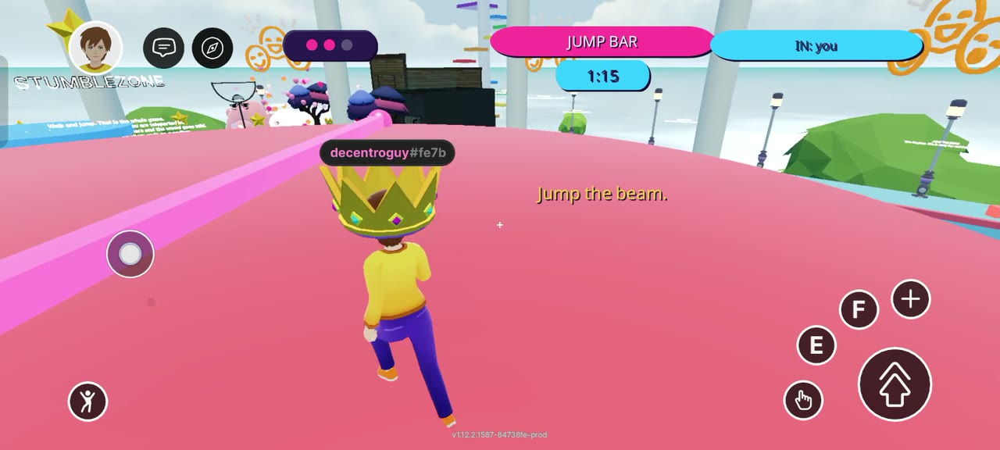
  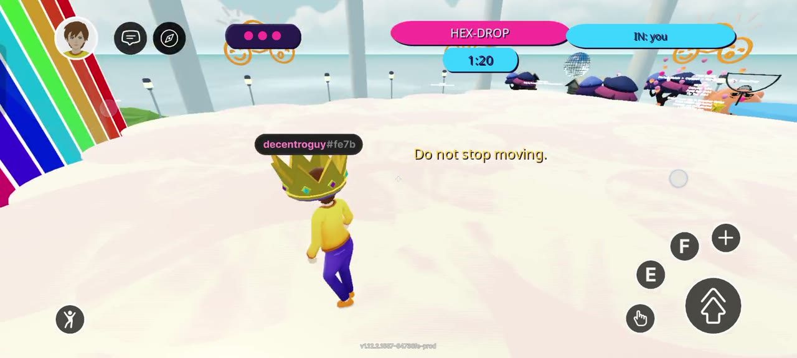
</p>

| Round | The idea |
|---|---|
| **Copycat** | A coach performs DANCE › CLAP › WAVE. You copy it, in order, in time, with your *own avatar's* emotes — pose buttons or the emote wheel — and the scene reads them back from the explorer. Wrong or late costs a heart; the sequence grows every wave. A round that could only exist here. |
| **Sweeper Gates** | Walls with a door-sized gap sweep the platform, faster each wave. Find the gap. |
| **Jump Bar** | One low beam sweeps the stage; jump it. A second beam at 50 s turning the other way; at 70 s everything reverses. |
| **Spotlight** | The stage goes dark and roaming pools of light hunt you across it. Linger in one and it costs a heart. A third light and a speed-up at 45 s; a two-second blackout at 60 s. |
| **Tip Toe** | Half the bridge tiles are fake and vanish forever once stepped on. Whoever leads sacrifices themselves to reveal the path. One gold tile is worth a crown. |
| **Perfect Match** | A 5×5 grid flashes colours, then blanks. A colour is called — by name as well as by colour. Stand on it or the floor drops. Later waves may *switch* the call. |
| **Crown Rush** | King of the hill. A crown zone on the stage; every second inside is a point; it hops every 12 s and shrinks. Nobody is eliminated — most points wins. |
| **Hex-Drop** *(the final)* | Four stacked layers of tiles that fall away seconds after you touch them; the top deck crumbles on its own at 60 s. Last one standing takes the show. |

Three hearts per round. Power-ups — a **SHIELD** that absorbs one heart and a **BOOST** for eight
seconds of speed — appear at 20 s and 50 s on the clock-driven rounds, seeded per player and
takeable once each.

---

## The show

<p align="center">
  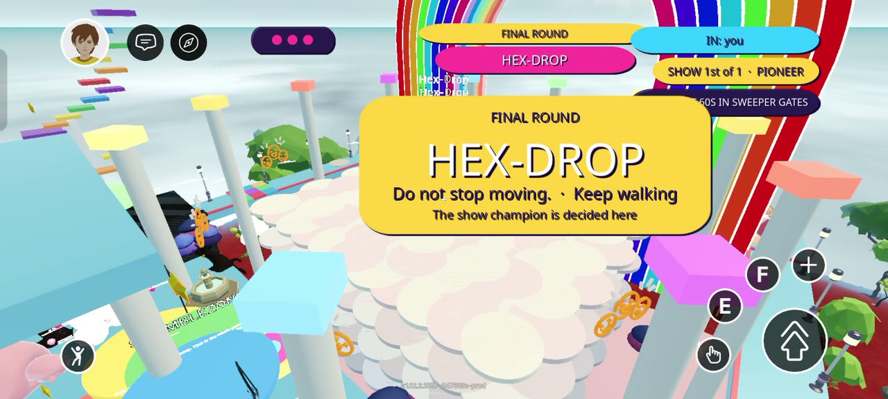
  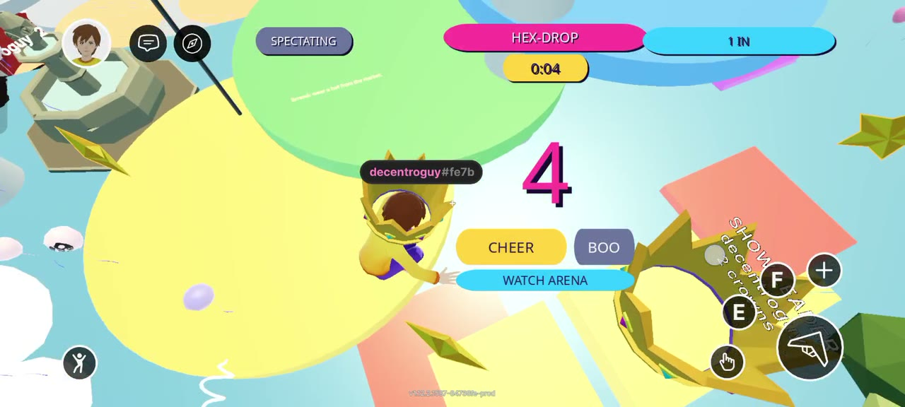
</p>

**Four acts.** Each show draws three rounds from the pool of seven — seeded by the show number,
ordered easy to hard, never repeating inside a show — and always ends on **Hex-Drop**, the only round
whose floor genuinely runs out. Two shows in a row are two different cards.

Every round opens on a **card**: the category tag, the name, what to do, the one control it needs
and the twist that is coming — over a six-second crane shot of the board, so you see it before you
are on it. A 3-2-1 that flips colour every tick, a whistle, and you are in. Fifteen seconds of
results, then the next one.

After the final: the top three take the **podium**, the champion wears the **crown**, every client
gets the **curtain-call camera**, and then the podium turns into a dance floor — everyone's pose
buttons open for fifteen seconds.

Every fourth show is a **Golden Show**: double crowns, a gold card, a gold jumbotron, and a
countdown on the lobby board so there is a reason to stay for one more.

---

## The crowd

<p align="center">
  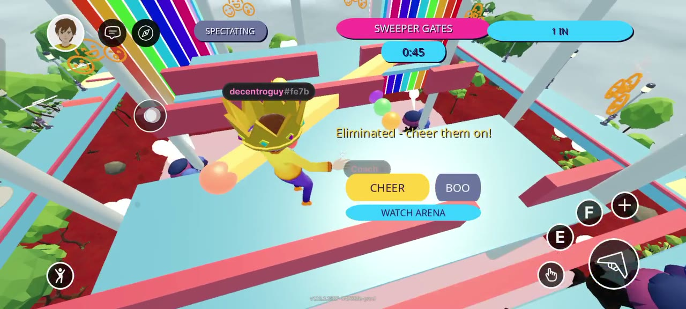
  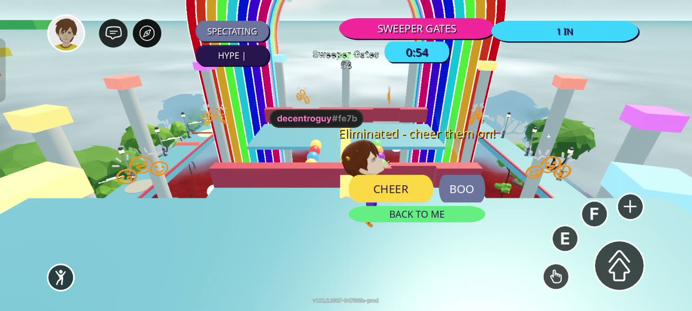
</p>

Being eliminated is the start of a different game. You land on a ledge over the arena — deliberately
*not* frozen — with three things to do:

- **CHEER** and **BOO**, on real on-screen buttons a thumb can hit.
- **WATCH ARENA** — one tap points your camera at the round you were knocked out of, instead of
  asking you to wrestle a third-person camera round on a touchscreen.
- **Pick who wins** — back a player from the ledge: +1 if they qualify, +2 if they win outright.

**Five cheers in ten seconds and the stadium goes wild**: a roar, confetti over the arena, the pillar
caps flash, the board says so — and every survivor gets a **CROWD BONUS** crown. It is the only way an
eliminated player changes what happens on screen, and it is entirely in their hands.

Everything is named. A **live feed** in the corner ("Alice is OUT", "Bob finished 2nd", "Cy cheers!").
A **rivalry line** on your results card ("You outlasted Alice by 4s") and a **GG** button that reaches
that one person. **DANCE / CLAP / SHRUG** on every results card. The show leader **wears a crown**;
anyone on a streak wears a **star** over their name tag — computed identically on every client from
the same messages, so everybody sees the same crown on the same head with nothing synced.

---

## Stumble Village

<p align="center">
  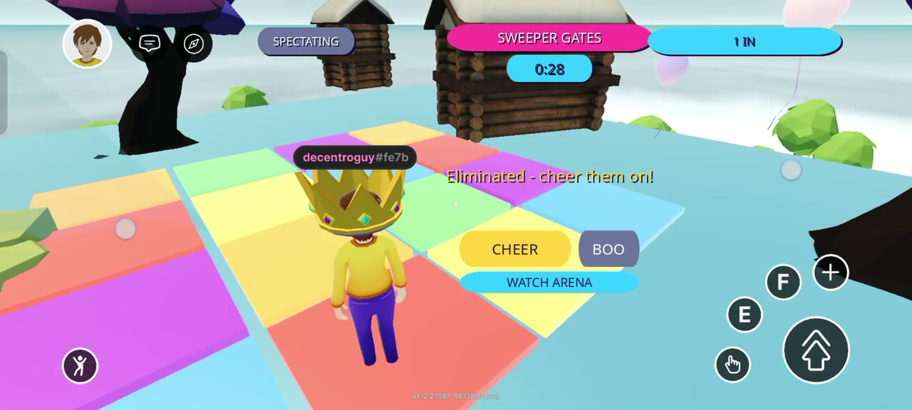
  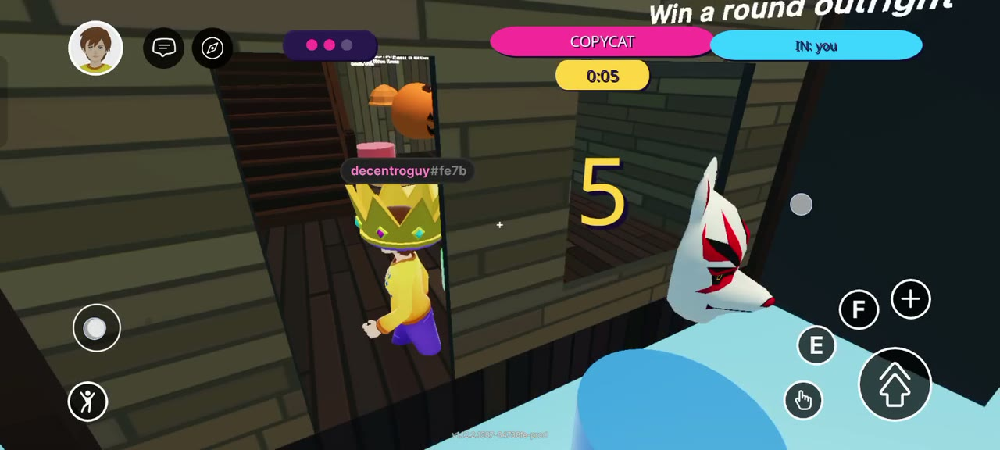
</p>

The scenes that hold a crowd in Decentraland are the ones with a *place* around the game. The
village is that place, at lobby height around the stadium, and every part of it feeds crowns, the
board and the errand list:

| Where | What |
|---|---|
| **Hat Market** | Seven hats on seven pedestals, each earned by something you did in the show — qualify once, fall three times, a three-streak, an outright win, a championship. Tap one and everyone sees it on your head. |
| **Disco Deck** | Party tiles under a mirror ball with their own spatial disco loop. Step on and the pose row appears; the wait between rounds is a dance floor. |
| **Star Hunt** | Five stars a day, placed by the UTC day's seed. A crown each, three more for all five. |
| **Stumble Tower** | Twelve platforms spiralling up the west corner, a lookout, and a stopwatch to the board. |
| **Sky Course** | Fourteen platforms from the lookout to a glass-floored Sky Box 25 m over the village — every step a phone-sized jump, by test. |
| **The Big Drop** | Off the Sky Box onto three rings. Inside the middle one: PERFECT LANDING, +2. |
| **Practice Yard** | Four stations, one per hazard the show uses. No lives, no score — learn the moves, then play. |
| **Speed Lap** | Out to the corner pad and back against the clock. |
| **Hall of Fame** | Five plinths, the top five names, a crown turning on the first. |
| **Sky Cannon** | A pad that throws you fifteen metres up for the one view a phone camera never gives you. |
| **Sam the Host** | An avatar at spawn whose speech bubble says what's next: the schedule, the daily, the errand you're on, the hat you could unlock. |
| **Village Errands** | Six things per visit — a hat, a dance, the tower, three stars, a lap, the drop — one crown each and the **VILLAGER** title for all six. |

<p align="center">
  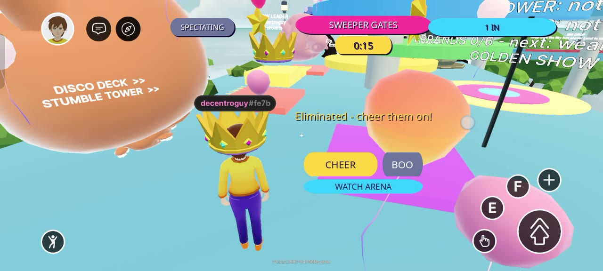
</p>

---

## Moments

<p align="center">
  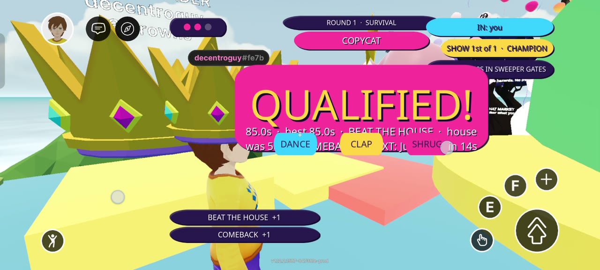
</p>

- **Bonuses with names** — CLUTCH (survived on your last heart), COMEBACK (qualified straight after a
  fall), CROWD BONUS (the spectators sent the meter to the top), BEAT THE HOUSE (every round has a
  house time: the opponent that never logs off).
- **Call-outs** — "Alice leads the show with 5" at the whistle, FINAL TWO when the field is down to
  two, ON FIRE at three in a row, PAST YOUR BEST the second you beat it, MVP at results.
- **A daily challenge** worth three crowns — a pure function of the UTC day, so it needs no storage
  and every client shows the same one.
- **Titles** — PIONEER, IRONFOOT, SURVIVOR, CHAMPION, VILLAGER — under your standing.
- **A session summary** on the end-of-show card: rounds played, qualified, best streak.
- **The last five seconds** as 150 px numerals, and a crowd bed that swells with the hype meter.

---

## Built for a phone

Designed for touch from the first commit, not ported to it.

- **Walk and jump.** No aiming, no camera skill, no precision taps. Actions bind only to `IA_JUMP`
  and `IA_PRIMARY` — the large, always-reachable mobile buttons — never to the action keys that hide
  behind a secondary menu on mobile.
- **Every rounded plate in the HUD is a tinted PNG texture**, generated by
  [`tools/make-ui.mjs`](tools/make-ui.mjs). The mobile client ignores `borderRadius`, so a HUD built
  the obvious way renders as hard rectangles on the one device this scene is for. A test bans the
  property.
- **Every label has an explicit size, no emoji anywhere** (the Unity client ships no glyphs), and
  `screenInset: 'interactable'` keeps the whole HUD clear of the notch, the joystick and the jump
  button. Long readouts are packed into lines that fit their card, because labels do not wrap.
- **Two screen regions, one owner each.** The centre and the band above the joystick each show
  exactly one thing, decided by a pure function whose test enumerates every combination of flags.
- **Nothing mobile cannot render** — no particle systems, no dynamic lights, no nine-slice textures,
  no `InputModifier`.
- **Timers tuned for touch.** The memory phase never drops below 2.5 s; the final sweeper wave once
  closed every 1.6 s and a test now bounds it.
- **Verified on-device** — a Realme 12 5G on the live World, and the SDK's `--mobile` preview
  throughout. The phone checklist is [docs/TESTING.md](docs/TESTING.md).

**Budget.** 3.6 MB of assets (1.5 % of the scene's allowance); under 10 % of the mobile entity soft
limit; every round's pool built once at boot and reset between rounds, so a World running
unattended for a week has a flat entity count; motion is engine-side `Tween`, not per-frame
transform writes; all music, ambience and stingers are synthesised procedurally by
[`tools/make-audio.mjs`](tools/make-audio.mjs); fourteen small CC0 models for the singular things.
`npm run budget` prints the weight and fails over the limits.

---

## How it works

**There is no backend.**

```
slot   = floor(utc_seconds / 120)          one round per slot
act    = slot mod 4                        which act of the show
show   = floor(slot / 4)
round  = act < 3 ? showRounds(show)[act]   three of seven, drawn by the show's seed, easy → hard
                 : HEX_DROP                the final, always
seed   = hash(slot)                        every layout, colour, wall speed and gap position
golden = show mod 4 == 3                   double crowns
```

Computed identically on every client. A player joining mid-round reconstructs the exact board
everyone else sees without exchanging a message. The only network traffic is what players *cause* —
`eliminated`, `finished`, `tile`, `cheer`, `pick` — over the SDK's message bus, every payload
stamped with its slot so a stale message can never sink a tile in the round that just started.

Things that look like they need a server and do not: the worn crown, streak stars, the hype meter,
the daily challenge, the show draw. Each is a pure function of messages every client already
receives, so every client reaches the same answer independently.

Clock skew is absorbed by a five-second get-ready freeze at the start of every round, which a unit
test proves is sufficient for a second of drift. The upshot: **nothing can go down.**

Full detail in [docs/ARCHITECTURE.md](docs/ARCHITECTURE.md).

---

## Getting started

Requires **Node 22+** (the SDK CLI uses `fs.globSync`; Node 20 fails with an opaque `TypeError`).
The version is pinned in `package.json` via Volta.

```bash
git clone https://github.com/Prashant-thakur77/stumblezone.git
cd stumblezone
npm install

npm run start               # desktop preview
npm run start -- --mobile   # prints a QR to open the scene on your phone

npm test                    # 156 unit tests, under a second
npm run build               # bundle + type check
npm run budget              # asset weight against the scene's limits
npm run smoke               # headless boot: 1,100 frames through every round
npm run smoke2              # two clients on one bus agree on every crown
npm run verify              # all of the above
```

Deploying to a World is one command, signed in the browser with the wallet that owns the name:

```bash
npm run deploy -- --target-content https://worlds-content-server.decentraland.org
```

See [docs/DEPLOY-SETUP.md](docs/DEPLOY-SETUP.md). No key is ever stored in this repository or in CI.

---

## Project layout

```
src/
  config.ts       every number the game is tuned by, in one place
  index.ts        boot order: audio, scenery, lobby, spectator, HUD, scheduler, crown sync
  lib/            pure logic - no SDK imports, every file unit-tested
    schedule.ts     UTC slot math and the show draw: the thing that replaces the server
    prng.ts         splitmix32 hash + mulberry32
    layouts.ts      seeded per-round layouts
    copycat.ts      the coach's sequences and the timing window
    spotlight.ts    roaming-light paths and the linger timer
    jumpbar.ts      beam pacing
    crownrush.ts    the hopping zone
    hype.ts         the crowd meter
    feed.ts         the corner feed's expiry rules
    field.ts        field readout and rivalries
    bonus.ts        CLUTCH / COMEBACK / CROWD BONUS
    house.ts        the house time per round
    daily.ts        the day's challenge
    titles.ts       PIONEER / IRONFOOT / SURVIVOR / CHAMPION
    streak.ts       qualifying streaks
    hats.ts         the seven hats and what unlocks each
    stars.ts        the daily star hunt
    tower.ts        the tower spiral, with a test that every step is a phone-sized jump
    sky.ts          the sky course, same rule, plus the box over the drop pad
    drop.ts         landing scoring
    lap.ts          the speed lap's start / turn / finish rule
    practice.ts     sinking-tile timing
    errands.ts      the six errands and the pay-once rule
    layout.ts       which one thing each screen region shows
    text.ts         packing a readout into lines that fit a card
    tips.ts         what the host says, and in what order
  arena/          the tile pool, the lobby, the village, the shared round stage, eight rounds
  systems/        scheduler, spectator, cosmetics, camera, feed, hype, records, audio
  net/            message-bus wrapper and the session crown tally
  ui/             the mobile HUD: react-ecs, textures, theme
tests/            node:test - one file per invariant
tools/            asset generators (audio, UI textures, thumbnail), budget, headless smoke runs
assets/           models (CC0), generated audio, the scene composite
docs/             vision, architecture, submission pack, phone checklist, video script, research
```

---

## Testing

`npm test` runs **156 tests** over the parts where a bug is invisible until a live round breaks.
Each encodes something that was found and fixed:

| Test | What it proves |
|---|---|
| **Clock skew** | Samples 1,200 points across a slot; two clients one second apart disagree only at the boundary. The evidence for shipping with no clock synchronisation. |
| **Tip Toe solvability** | Every one of 500 seeds has a connected path to the far side. Random fake-tile placement eventually produces an unwinnable round that *every client agrees on*. |
| **Perfect Match fairness** | Every board, every seed, has at least four safe tiles. |
| **Show variety** | Fifty shows in a row each draw three distinct pool rounds, easy to hard, ending on the final, and differ from one another. |
| **Spotlight paths** | Every light, every quarter-second, stays on the stage. A Lissajous figure whose axes each swing the full radius leaves the disc at the corners. |
| **Phone-sized jumps** | Every step of the tower and the sky course is within the avatar's jump, by number. |
| **Screen regions** | A box-overlap check of the virtual canvas: no two HUD elements can collide, for every combination of flags. |
| **Mobile UI rules** | No `borderRadius` in any UI file; every texture the HUD names exists on disk. Both fail silently on a phone. |
| **Geometry and pacing** | The kill plane clears every standable surface; every round fits the parcels and the height cap; wall pacing stays within touch reaction time. The kill plane once sat exactly on Hex-Drop's lower deck. |
| **Round registration** | Every round in `ROUND_NAMES` is registered in `index.ts`, in order. A swapped list runs the wrong round silently. |

Two runs go further than unit tests. **`npm run smoke`** loads the real bundle with the renderer's
host APIs mocked, lets the SDK's own startup call `main()`, and runs 1,100 frames through every round
and phase — it found a wall built without a `Transform` that threw every frame of one round, missed
by the type checker, the tests and the desktop preview. **`npm run smoke2`** loads the bundle twice,
wires each client's bus into the other's, steers one player into the Crown Rush zone and the other
out, runs twelve slots, and asserts both clients name the same winner — its first run found that the
per-show tally was never shared at all.

---

## Judging criteria

How the project maps to the Friendzone Buildathon's seven criteria, in one line each:

| Criterion | Where it shows |
|---|---|
| **Mobile-first experience** | Walk and jump only; texture-based HUD; nothing near the joystick; verified on a Realme 12 5G. [Details](#built-for-a-phone). |
| **Social value** | The ledge — CHEER, BOO, WATCH ARENA, pick who wins, a crowd that changes the outcome; a named feed; rivalries; GG; worn crowns. [Details](#the-crowd). |
| **Mobile UX & accessibility** | Explicit label sizes, no emoji, colours named in words as well as shown, one owner per screen region, `screenInset`. |
| **Performance** | 3.6 MB; <10 % of the entity budget; pooled entities; engine-side tweens; procedural audio; `npm run budget`. |
| **Creativity** | A show that schedules itself from UTC with nothing to fail; a round (Copycat) that reads your own avatar's emotes back. |
| **Retention & discovery** | A round every two minutes; a daily; the Golden Show; titles, streaks, hats, errands; a different card every show. |
| **Execution** | 156 tests, two headless smoke runs, 125 commits, and every limitation written down in [docs/SUBMISSION.md](docs/SUBMISSION.md). |

---

## Roadmap

- **Cross-session persistence** of crowns, hats and personal bests via the Decentraland Multiplayer
  Server — designed for ([docs/ARCHITECTURE.md](docs/ARCHITECTURE.md), Layer 2) and deliberately
  not depended on, so nothing can go down during judging.
- **Ghost times** on the tower and the lap.
- **Scheduled events** — "Crown Rush Hour" — announced through Decentraland's event system.
- More rounds for the pool; the round interface is four functions and a spawn point.

Post-buildathon, this is a candidate for the DCL Regenesis Labs Grants Program and the Creator
Success Program.

---

## Credits and licence

Built by [Prashant Thakur](https://github.com/Prashant-thakur77) for the
[Decentraland Friendzone Mobile Buildathon](https://dorahacks.io/hackathon/friendzone), solo.

All gameplay code was written for this project. Decoration is CC0 models from the OpenDCL catalog;
announcer lines are from Kenney's CC0 voice pack; every other sound is synthesised in this repo.
Full attributions in [CREDITS.md](CREDITS.md). Licensed under the [MIT Licence](LICENSE).
